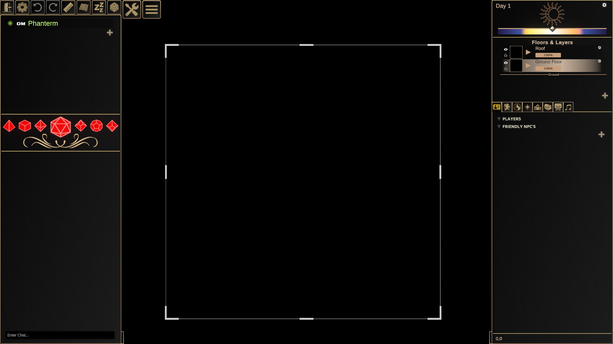
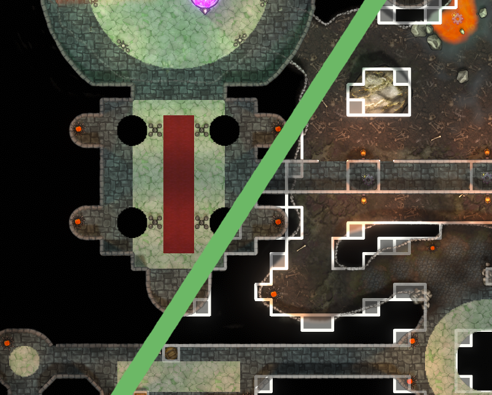

# Quick Start Guide

## 1. Downloading DMHub

Perhaps unsurprisingly, the first thing you should do to get started is download DMHub!

### Windows
You can download the windows version of DMHub from either the [DMHub website], or over on the [itch.io] page.

### Mac
DMHub has a Mac version that can be downloaded on the [itch.io] page.

## 2. Logging In

Upon installing and launching DMHub, you'll be greeted by a login page where you'll need to enter your email and password. If you don't have one, click **Register an Account** to do so.

On the following screen, choose your preferred display name, enter your email, choose a strong password, and then confirm your age and agree to the terms of service.

{: .warning }
DMHub currently does not send confirmation emails, so please make sure you're entering the correct information before you register!

Click the **Register** button that pops up in order to complete registration. Welcome to DMHub!

## 3. Create Your First Game

1. From the title screen, click **Play**. You will be brought to a list of games. 
2. Click **New Game**.
3. You can either join an existing game by entering that game's code, or host one of your own. Click **Host Game**.
4. Enter the name of your game. You can also choose cover art, modify the game description, and set a custom password, if you desire.
5. When you're finished, click **Play** to start!

{: width="50%" height="50%"}

## 4. Main Navigation

Upon creating a new game, the editor will generously provide you
with a black void for your starting map. But don't worry -- we'll fix
that in no time. The first thing you may want to do is familiarize
yourself with a couple of settings to ensure that your workflow is
comfortable.

<!--<!--  -->

### Editor Settings

First, click on **Windows** -> **Map Editing** -> **Editor Settings**.

The Editor Settings panel allows you to control a few options that might
come in useful while creating your map. For example, some authors prefer
to work on a grid and use snapping for maximum precision when placing
objects. Some do not -- it is up to you.

These settings are for the editor itself, and will remain in place
regardless of what map you have loaded.

#### Show Pathfinding Overlay

Displays pathfinding data for movement based on the solidity of
buildings and objects currently on the map.

#### Snap to Grid

When enabled, snaps drawing actions to the grid.

#### Snap Objects to Grid

When enabled, snaps the placement and movement of objects to the grid.

#### Show Invisible Tokens

Reveals tokens which would otherwise be invisible.

{: width="50%" height="50%"}

[DMHub website]: https://dmhubapp.com/
[itch.io]: https://dmlabs.itch.io/dmhub