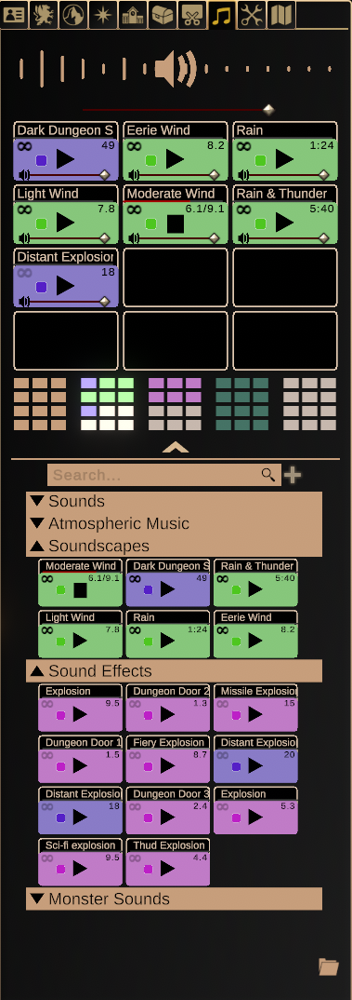

# Audio Panel

In addition to supporting a wide variety of map editing functions, DMs
may also use sound effects, music, and even complete soundscapes in
order to further enhance the atmosphere of their settings.

The audio panel consists of five main soundboards that come
pre-populated with music and sounds. Of course, the real fun comes with
uploading your own, and then assembling them into your own soundboard.

## Playing Audio

Controlling audio is simplicity itself. Each file will have an icon you
can click to play or stop it, layering as much sound as you desire. Next
to the playback icon is a square which represents the color of the
sound's icon in the soundboard. To loop a sound, click the icon on the
top left of the file. You can also adjust each file's individual volume.
You can click on the audio file's header to rename it, and drag files
around to reorganize them.

## Uploading Audio

To upload audio, click on the **+** icon next to the search bar on the
audio panel. You will be prompted to drag & drop or choose an audio file
of the corresponding filetype at the following window. Once it's
uploaded, the audio file will immediately appear in the **Sounds**
folder. Feel free to move it from here by either dragging it to the
desired folder, or right-clicking on it and selecting **Move to...** in
order to select a target destination.

{: width="50%" height="50%"}

