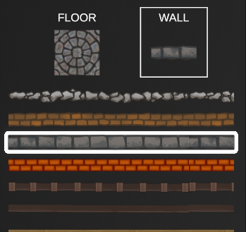
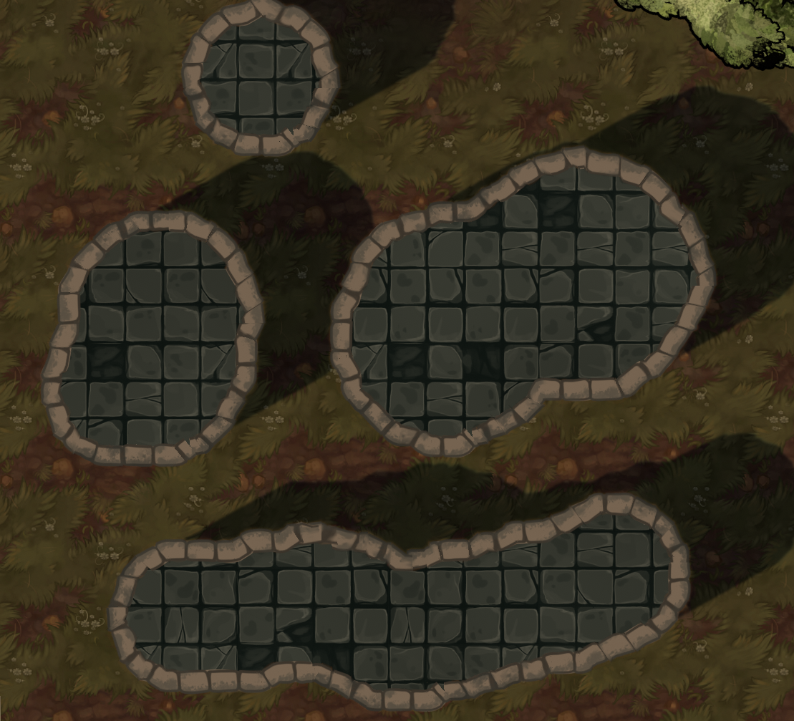

{: width="50%" height="50%"}

# Building Editor Panel

The building panel allows the author to place walls and floors in
tandem. These tiles are drawn on top of terrain for the current floor.
Walls can be customized in ways that not only affect their cosmetic
appearance, but how they interact with characters, light, and objects.

<!-- r0.5 {width="50%"} -->

You'll quickly notice that this panel shares many aspects with the
terrain panel. Its tools all function the same way, except that the
brush does not work with opacity when it comes to drawing floors. As for
what's new on the panel, there is a dropdown menu called **Mode** that
has three options: **Floors & Walls**, **Floors Only**, and **Walls
Only**.

## Editing Building Tilesheets

When editing building tilesheets, you have the same options as you would
when editing terrain properties, but with two additional settings:
**Tiling**, which lets you choose how the building floor is displayed,
and **Randomize Tile Orientation**, which will rotate and flip tile
images at random when they are placed.

For most operations, you'll likely want to use **Floors & Walls**, as
DMHub will assist in surrounding any floor you paint with the selected
walls. **Walls Only** is great for painting fences. **Floors Only** will
delete any walls you paint over while in this mode.

<!-- <!--  -->

## Editing Walls

From the building panel, you can edit walls by selecting the current
wall, then right clicking on the one you wish to modify. To create a new
wall, scroll down and click the plus **+** icon.

{: width="50%" height="50%"}

#### Description

The name of this asset as it appears in the editor.

#### Shadow Mask

You can add a mask to the shadow cast by this wall. An example might
include a lattice pattern for a fence, or iron bars for a cage.

#### Hue Shift

Shifts the hue of the existing image from a value of 0 (default) to 1.

#### Saturation

Saturates or desaturates color within the image.

#### Brightness

Determines light and dark brightness for the image.

#### Blocks Sounds

The amount this wall will dampen sounds to those on the other side of
them.

#### Wall Height

The height of a wall will determine how large of a shadow it casts when
affected by light sources.

#### Shadow Distortion

The height of a wall will determine how large of a shadow is cast by
light sources.

#### Blocks Light

When enabled, this wall will stop any light that hits it.

#### Blocks Vision

When enabled, this wall will prevent characters from seeing beyond it.

#### Blocks Movement

When enabled, this wall will prevent characters from moving through it.

#### Blocks Flying

When enabled, this wall will prevent flying characters from moving
through it.

#### Cover

Set whether this wall provides no cover, half cover, three-quarters, or
full cover.

