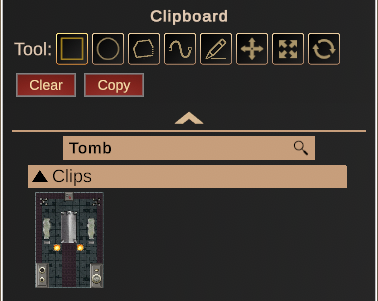
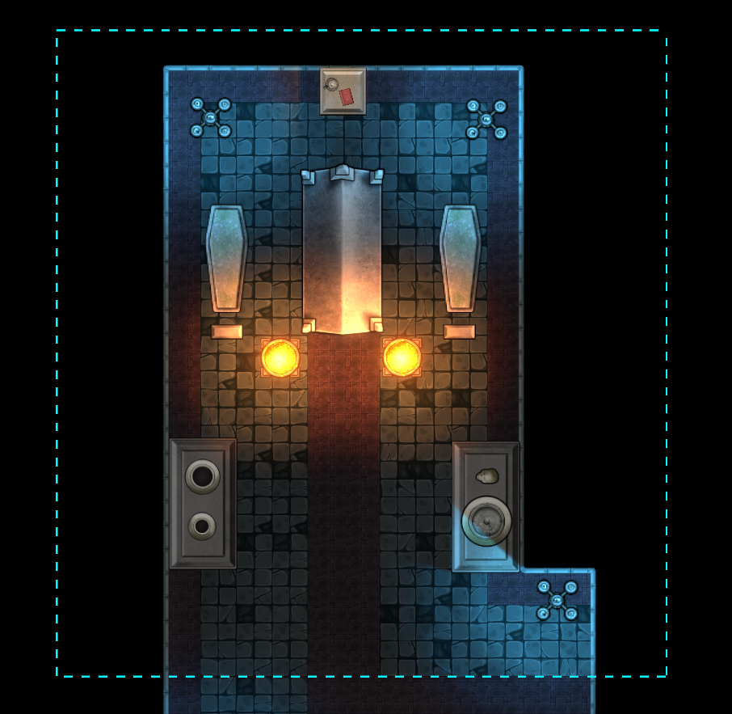
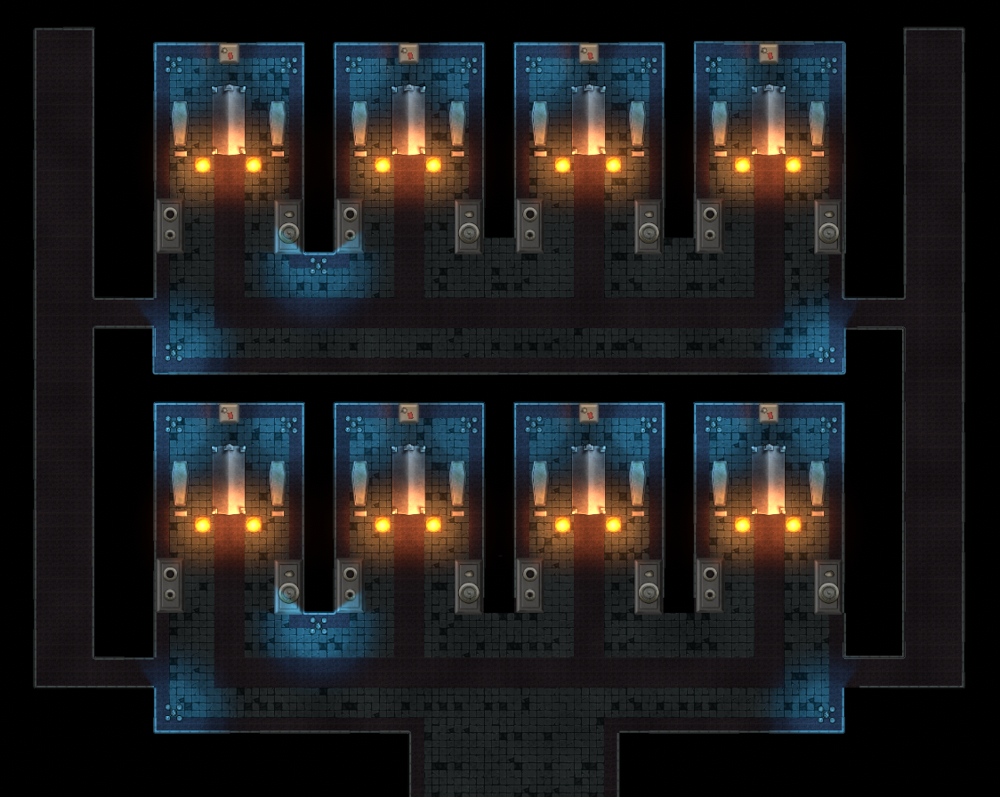

# Clipboard Panel

Once you've gotten the hang of object placement, it's likely you'll want
to save certain clusters of objects and use them again, even on other
maps. Enter the **Clipboard** panel.

{: width="50%" height="50%"}

With the clipboard, you can select both objects and building tiles,
copying and even saving them for later. Afterward, you can place your
clip just like you would an individual object.

### Creating a Clip

By using one of the available tools from the panel, you can select
building tiles, walls, and objects. The selection outline is represented
by a dotted blue border.

{: width="50%" height="50%"}

After you've made your selection, on the clipboard panel, click
**Copy**. You should see the selected clip appear in the panel. If you'd
like to make a different selection, click **Clear**.

To save your clip, click on the downward pointing arrow at the bottom of
the panel. From here, you should see a folder icon. Click it and create
a directory for your saved clips. You can now drag the clip into this
folder, where it will be saved. Right click on the clip to rename it and
give it a description, if you'd like -- having a name will allow you to
search for it more easily the next time you wish to use it.

Now you can open new maps and access these clips! Clips will also retain
the properties of any objects you happen to select, so it's ideal for
any situation where you need to duplicate a lot of assets in a short
amount of time. Building one room in an inn suddenly means having every
room ready to place.

{: width="50%" height="50%"}

{: .tip }
> Even if you're not much of a map builder and are more of a DM,
> objects you've built with complex logic or chests with certain kinds of
> loot are not exempt from the clipboard -- building assets in-between
> sessions and having them ready to deploy at a moment's notice will pay
> dividends and ensure you can dedicate your time running your campaign.