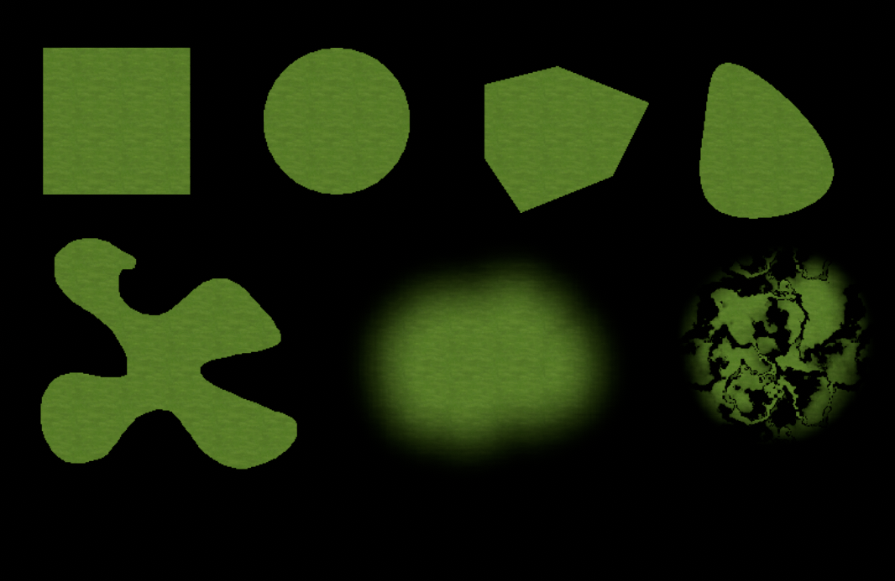
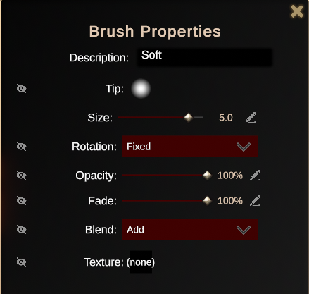
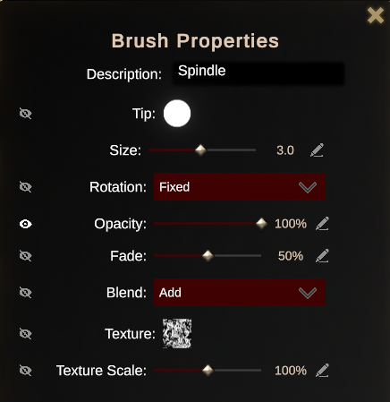
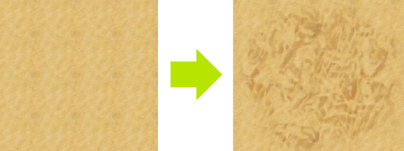

# Drawing Tools

{: width="50%" height="50%"}

There are several tools at your disposal for drawing in DMHub,
located at the top of map editing panels like [Terrain], [Building], and [Effects]:

## Rectangle Tool

Allows you to draw a quadrilateral.

### Circle Tool

Draws a circle starting from where you click and drag the cursor.

### Shape Tool

Create shapes point-by-point, connecting them together to finalize and
fill the shape with the currently selected swatch. You can also hold left click
as you draw to create curves!

### Curves Tool

Similar to the shape tool, the curves tool allows you to more
flexibility over how you specify the control points which determine the
curve.

### Free Draw Tool

Use this tool to draw freehand shapes. Increasing the **Smoothness**
value will compensate for any jagged shapes or sharp angles, smoothing
them out.

### Brush Tool

The ideal tool for blending terrain and applying patterns using custom
alpha-based brush images.

{: .note }
When drawing Effects, only the Brush Tool may be used.

### Picker

Use this tool to click on a surface, grabbing the swatch data and
applying it to your cursor the next time you would draw.

All but the brush tool has a setting for **Fade Edges**, which allow you to soften your shapes if you find the default look too jagged. You can also **Lock Opacity** to prevent drawing on the alpha (transparency) channel, and toggle the **Eraser**.

{: .note }
Buildings are always drawn with hard edges, and so cannot be blended or softened like terrain or effects.

{: .tip }
> You can also hold ALT while drawing to toggle the eraser, and SHIFT
> to quickly use the Picker to apply the selected swatch to your cursor.

## Creating Brushes

To create a new brush, click on the **+** icon at the end of the brush list. To edit an existing brush, right-click on it and select **Edit Brush** . This will bring up the **Brush Properties** window.

{: width="50%" height="50%"}

Each brush property can be exposed on their associated panels by clicking on
the eye icon, allowing you to adjust them on the fly. If you're a tablet
user, you can also click on the pen icon to bring up pen pressure and
velocity settings.

#### Description

The name of this asset as it appears in the editor.

#### Tip

The alpha mask image that determines the shape of the brush when
drawing. Click on this to select other tips, or upload your own.

#### Size

The radius of the brush tip. While this property is exposed on the
terrain panel, you can press `[` or `]` to decrease or
increase the size.

#### Rotation

Can be set to either Fixed or Stroke Direction. A fixed brush will
retain its orientation as you paint. Otherwise, the brush rotates to
match the direction in which you draw.

#### Opacity

Can be set from 0 to 100 to determine how much of the selected terrain
is drawn during a single pass.

{: .note }
When drawing Buildings, this setting has no effect on brushes and should be kept at 100%.

{: .important }
> Note that as of this writing, DMHub only supports up to 4 terrain data
> on a single square. If you try to draw any more, you will begin to see
> image artifacts.

#### Fade

Applies alpha fading to the edges of the current brush. A value of 100
will apply no fade. Has no effect when drawing Buildings.

#### Blend

Determines how this swatch is drawn onto the map. **Add** will add the
swatch according to the opacity value, while **Max** will cap the
swatch at the current opacity, even if you draw over it with several
passes.

#### Texture

Adds a texture mask to this brush, allowing the painting of patterns and
other unique features. Click on the box to open a window containing
existing texture masks, or add your own! 

When drawing buildings, texture masks only apply to the outlines of the brush area.

#### Texture Scale

Allows you to shrink or enlarge the scale of the texture mask.

{: width="50%" height="50%"} 
{: width="50%" height="50%"}

[Terrain]: map-terrain.html
[Building]: map-building.html
[Effects]: map-effects.html