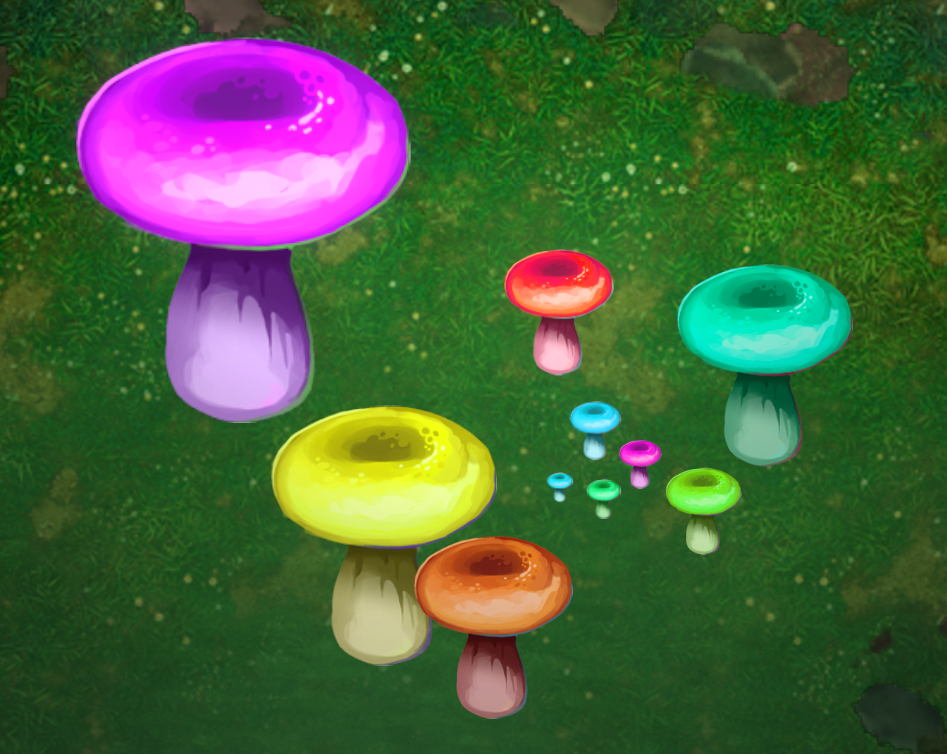

{: width="50%" height="50%"}

# Appearance

Has custom control over the appearance of this object.

####  Image Number

####  Image Swaps

####  Hue

####  Saturation

####  Brightness

####  Opacity

####  Additive Blend