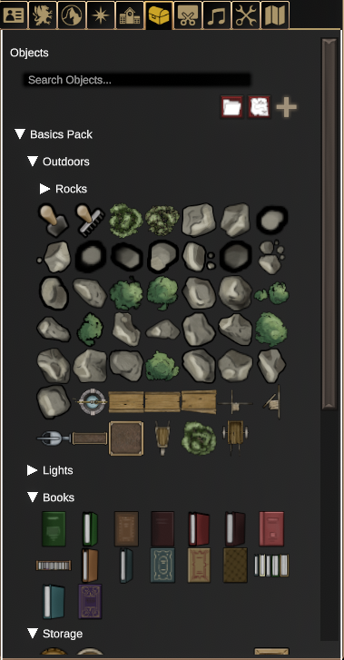
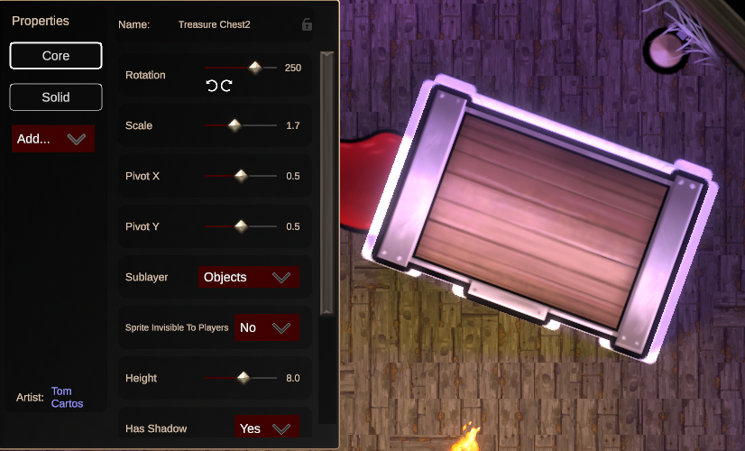

# Objects Panel

One of DMHub's most extensive and powerful features, objects are images
or animations that can be placed on the map and customized to a high
degree. The panel contains a search bar which can filter objects based
on their name or folder. Clicking on the folder icon will create a new
folder for your objects. Clicking on the map icon will allow you to
import a map image as an object.

## Placing Objects

After clicking on an object from the panel, you can place it into the
map as-is by clicking again, but you can also adjust the size of the
object by holding **Ctrl** and scrolling the mousewheel up and down. You
can do the same for its rotation by holding **Shift** instead.

{: .tip }
> You can adjust the size and rotation of any object after you place
> it. Just select the object you'd like to tweak -- or select multiple
> objects at once by holding **Ctrl** or **Shift**!

### Object Properties

After placing an object, you can select it to bring up the **Object
Properties** window for that object. This is where you can add new
properties or tweak them.

On the left side of the properties window, all of the properties
currently attached to this object can be seen. You can right-click on a
property and select **Delete Property** to remove it. On the right side
of the window, you can adjust all of the settings associated with the
selected property. All objects will have a **Core** property, though
there are many others you may choose to add.

