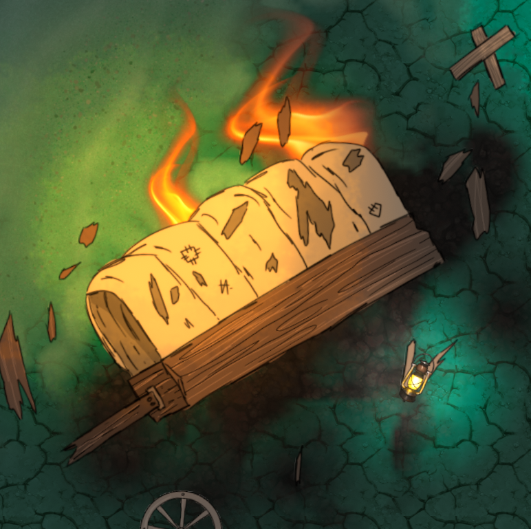

{: width="50%" height="50%"}

# Light

Objects with this property emit light.

####  Color

####  Style

####  Off Appearance

####  On Appearance

####  Intensity

####  Magical

####  Radius

####  Angle

####  Shadow Softness

####  Casts Shadows

####  Height

####  Flicker

####  Light On

####  Locked