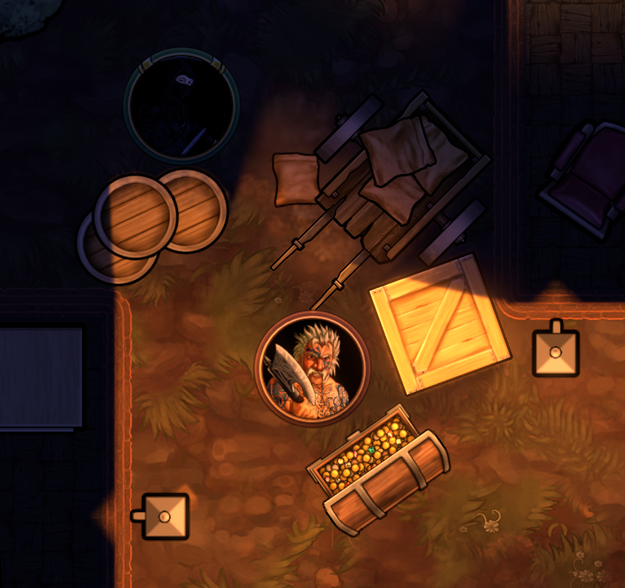

{: width="50%" height="50%"}

# Solid

Objects with this property can block movement, vision, and light through them. They can also allow objects to provide cover.

####  Block Movement

####  Block Light

####  Block Vision

####  Cover

####  Max Points

####  Manually Set Outline
